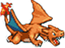
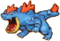
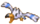
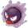
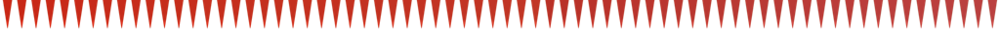
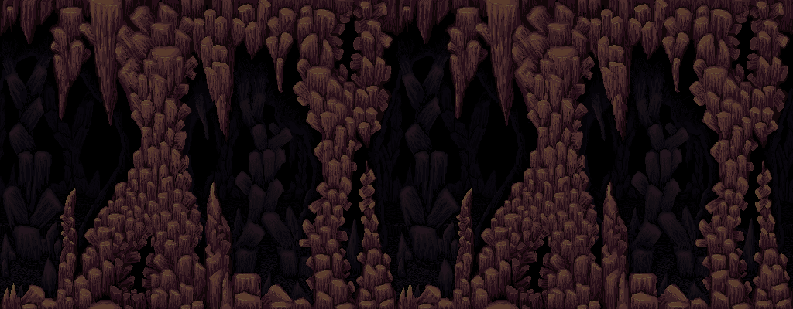
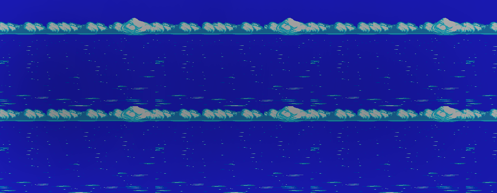

#Jackson Dahl
##Charizard Flyer Game
###Objective
The objective of the game is to fly for as long as possible without hitting an enemy or the top or bottom of the cave. Charizard will eventually fly faster and faster, making things more difficult.

###The Player

The player controls Charizard, who flies through the cave and can move up or down to avoid obstacles.

###Controls
The player plays the game by pressing and holding the shift key and letting it go (to have charizard go down and up) and by using the mouse to click buttons to start/pause/quit the game.

###Beginning the Game
The player has two options when the game opens (see below). They can click start to begin, but it will only start when they have typed in their name to the "enter name" field. Otherwise the game will prompt them to enter their name. The second option will come later (PA6). That is the high schores option, which they can click to see a list of names with high scores.

###Score
The score increases the longer the player stays alive without dying.

###Dying
The player has one life. The player dies when Charizard hits any kind of enemy or the top or bottom of the gave. 

###Immunity

Fireballs move in a wave motion across the screen, away from charizard, and are very rare). If Charizard hits (eats) one of these, he will be invincible for 200 score points seconds (meaning he can hit any object or the top or bottom without dying).
*Note: In this iteration of the game, fireballs malfunction and do not give Charizard immunity. He will merely pass through them without anything happening.

###Enemies
There are three types of enemies:

####Feraligatr

Feraligatr sits on the bottom of the cave and will jump up at various times, while sometimes staying on the bottom of the cave.

####Wingull

Wingull moves in a vertical line up and down the screen, from the top of the cave to the bottom, repeatedly.

####Gastly

Gastly moves around in the air of the cave in a completely random pattern, flying around to try and get charizard.

###Cave Walls

The cave walls, the one nonmoving object drawn in the layout below, will be spikey on the top and bottom. If Charizard hits these walls by either sinking too far or flying too high, he will die.

###Levels
##There are three levels:
1. The Cave

2. The River

3. The Sky

###Layout
The game's interface is drawn below. It is very straightforward.
[Click to view](https://photos-5.dropbox.com/t/0/AAC4Qq1eEihCZLJgRWWx6FeqZ9wqD2XeB7Jqvu0hVBRWcg/12/1888617/jpeg/32x32/3/_/1/2/Photo%20Apr%2021%2C%2010%2024%2003%20PM.jpg/1zPottuZYtJ4u9vokj-xhr0sC89H7Y6Bu4-zeMIS-NE?size=1280x960)

Note: The game is similar to the "helicopter game", but with enemies, for reference.
